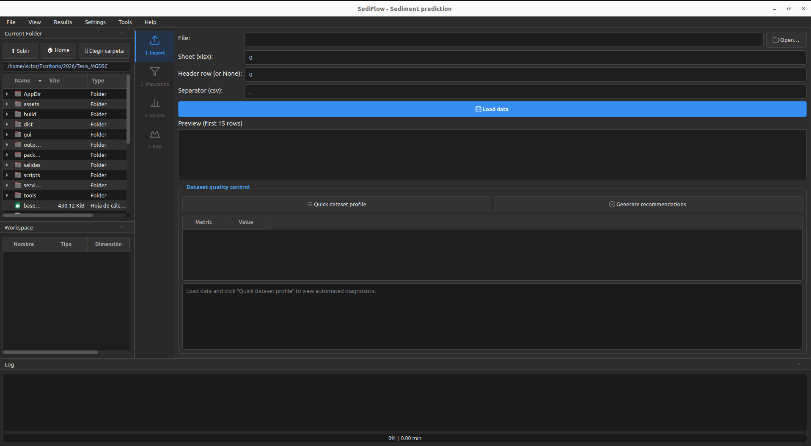
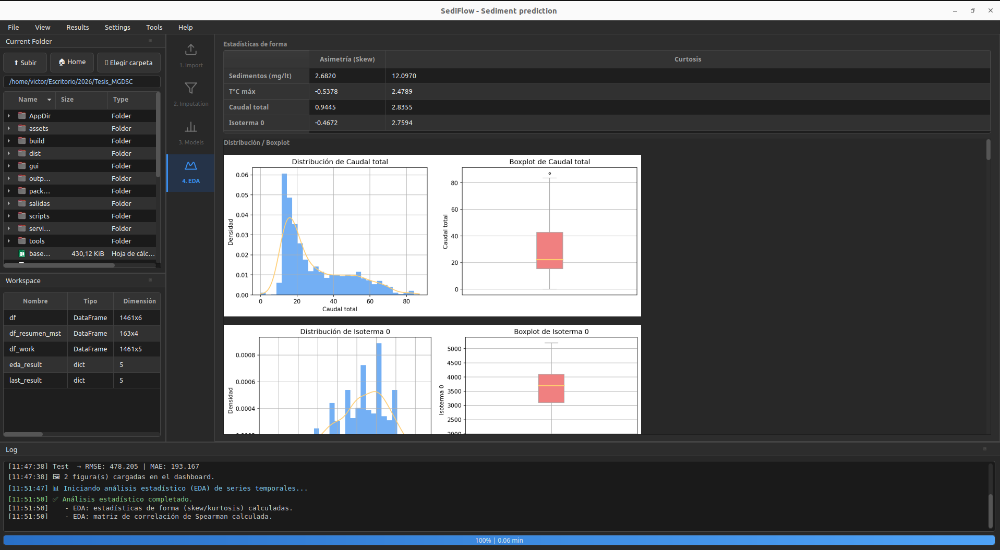
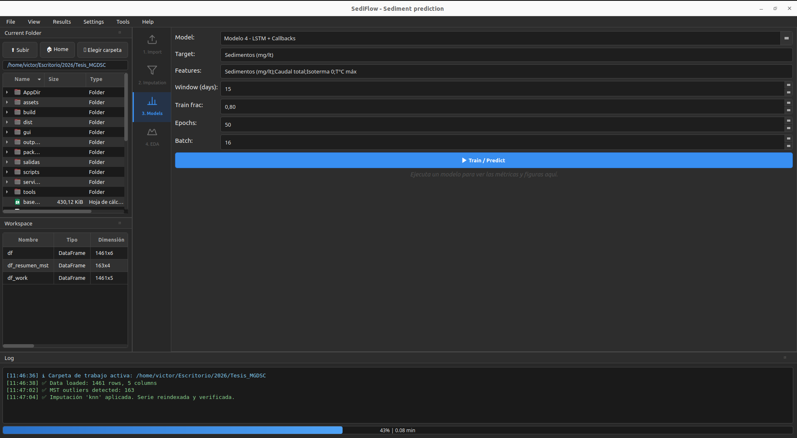
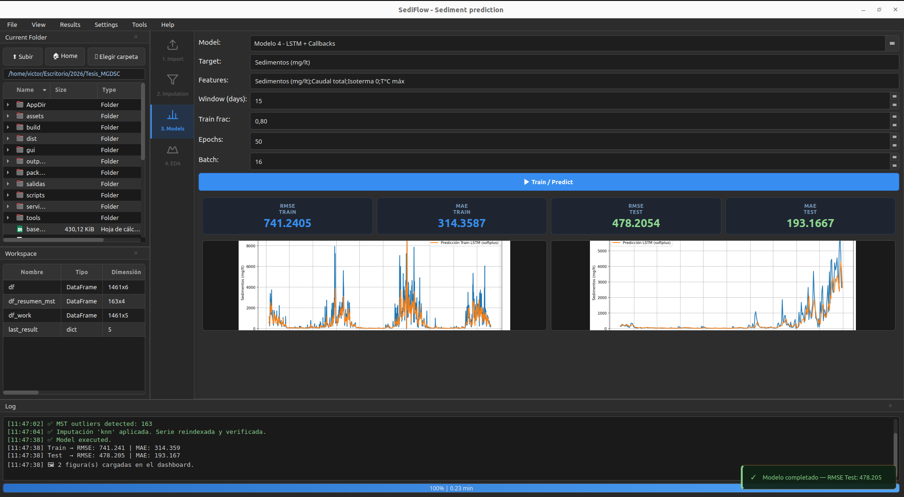

<p align="center">
  <!--  -->
  <h1 align="center">SediFlow</h1>
  <p align="center">Aplicación científica de escritorio para análisis, imputación y modelamiento de series temporales de sedimentos e hidrología.</p>
</p>

<p align="center">
  
  
  
  
</p>

---

## ¿Qué es SediFlow?

SediFlow es una herramienta de escritorio diseñada para investigadores y profesionales que trabajan con series temporales hidrológicas y de sedimentos. Integra todo el flujo de análisis en una sola interfaz gráfica: desde la carga de datos hasta la generación de pronósticos con modelos de aprendizaje automático.

---

## Características principales

| Módulo | Descripción |
|---|---|
| **Carga de datos** | Importa archivos CSV y Excel (`.xlsx`, `.xls`) |
| **Calidad de datos** | Detecta patrones de datos faltantes y anomalías |
| **Imputación** | Rellena valores faltantes con KNN e imputación iterativa |
| **Detección de outliers** | Algoritmo basado en Árbol de Expansión Mínima (MST) |
| **Análisis exploratorio (EDA)** | Estadísticas descriptivas, correlaciones y visualizaciones |
| **Pronóstico LSTM** | Redes neuronales recurrentes para predicción de series |
| **Pronóstico Random Forest** | Modelo de ensamble para comparación y validación |
| **Exportación** | Resultados, métricas, figuras y logs en CSV/Excel |
| **Bilingüe** | Interfaz disponible en español e inglés |

---

## Capturas de pantalla

<!-- Pantalla principal -->

<p align="center">
  
  <br/><em>Ventana principal - carga y vista previa de datos</em>
</p>


<!-- EDA -->

<p align="center">
  
  <br/><em>Módulo de análisis exploratorio (EDA)</em>
</p>


<!-- Pronóstico -->
<p align="center">
  
  <br/><em>Entrenamiento del modelo LSTM</em>
</p>

<p align="center">
  
  <br/><em>Resultados del modelo LSTM</em>
</p>


---

## Instalación

**Requisitos del sistema:**
```
Ubuntu 22.04 LTS o superior  /  Debian 12 o superior
```

```bash
# Descargar el .deb desde los assets de esta release
wget https://github.com/vosores/sediflow_release/releases/latest/download/sediflow_0.1.0_amd64.deb

# Instalar
sudo dpkg -i sediflow_0.1.0_amd64.deb

# Si faltan dependencias del sistema
sudo apt-get install -f

# Ejecutar
sediflow
```

Después de instalar, SediFlow aparece en el menú de aplicaciones bajo la categoría **Ciencia / Educación**.

Para desinstalar:
```bash
sudo dpkg -r sediflow
```

---

## Verificar integridad

Cada release incluye un archivo `SHA256SUMS_0.1.0.txt` para verificar que los artefactos no fueron alterados:

```bash
sha256sum -c SHA256SUMS_0.1.0.txt
```

Salida esperada:
```
sediflow_0.1.0_amd64.deb: OK
```

---

## Requisitos del sistema

| Componente | Mínimo |
|---|---|
| Sistema operativo | Linux x86_64 (Ubuntu 22.04+ / Debian 12+) |
| RAM | 4 GB (8 GB recomendado para modelos LSTM) |
| Disco | 1.5 GB libres |
| Pantalla | 1280 × 800 o superior |
| GPU | Opcional (mejora el entrenamiento LSTM con CUDA) |

Las dependencias de Python (pandas, TensorFlow, scikit-learn, PyQt6, etc.) van **incluidas** en el paquete — no necesitas instalar Python.

---

## Problemas frecuentes

**La app no abre tras instalar el `.deb`**
```bash
# Verificar dependencias faltantes
sudo apt-get install -f
# Ejecutar desde terminal para ver errores
sediflow
```

**Error de display / pantalla negra**
```bash
sudo apt-get install libgl1 libegl1
```

---

## Repositorio de desarrollo

El código fuente se encuentra en el repositorio privado de desarrollo. Para reportar bugs o sugerencias abre un issue en este repositorio.
